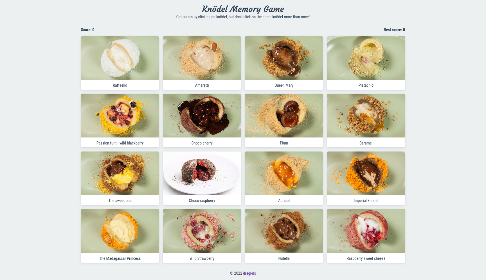

# Memory game - Odin project

Memory game made with React using functional components. This project was an assignment from [Odin's Full Stack JavaScript path](https://www.theodinproject.com/lessons/node-path-javascript-memory-card).

## Screenshots

